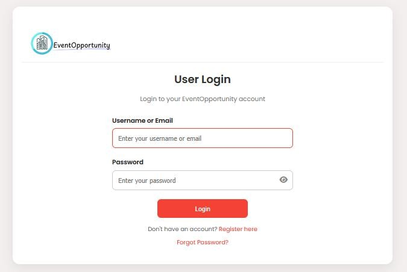
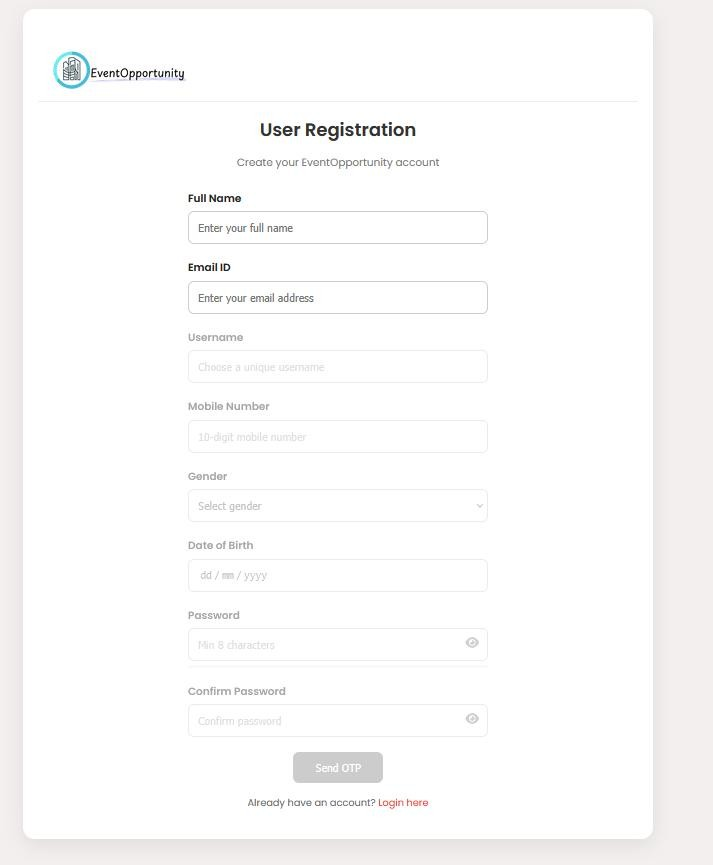
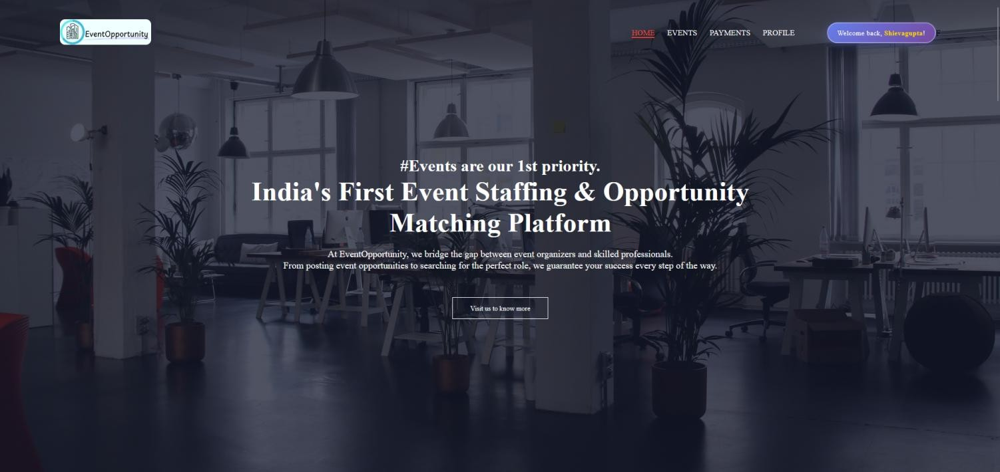
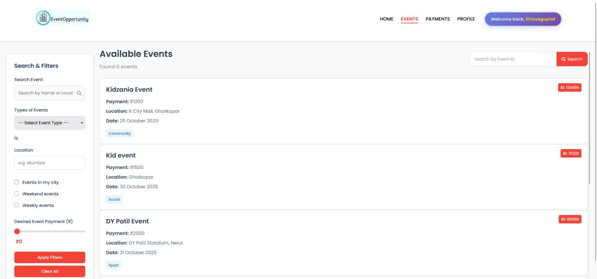
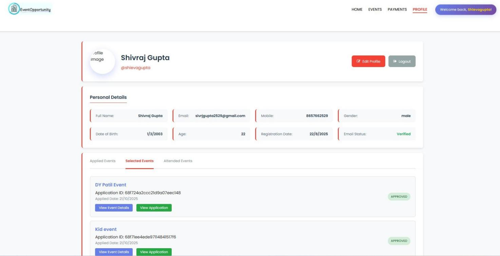
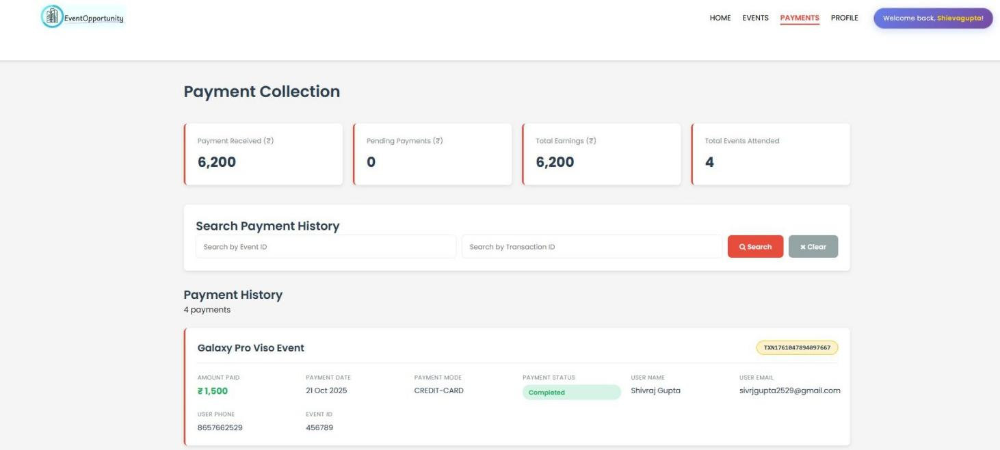
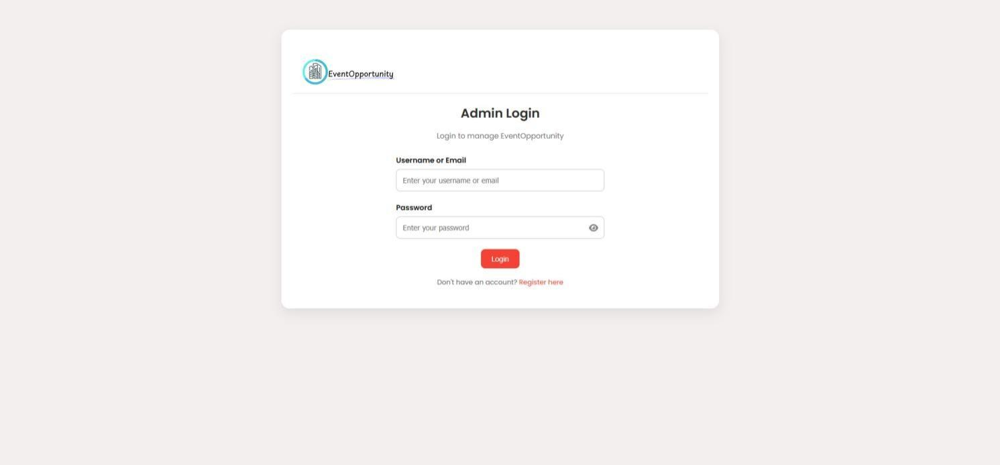
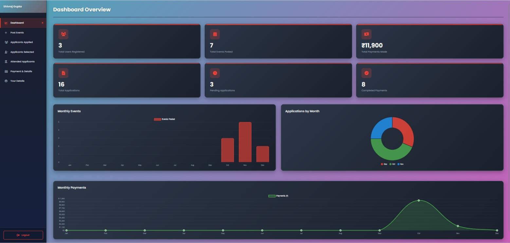

# 🎉 EventOpportunity

**EventOpportunity** is a full-stack web application designed to help users discover nearby events and connect with event organizers easily. The platform allows users to explore different categories of events — corporate events, social gatherings, entertainment shows, educational seminars, sports events, and community programs.

Users can register, view detailed event information, manage their profiles, and participate in events through a simple and responsive interface. The platform also includes an admin management system where administrators can add, update, and manage event listings efficiently.

---
## 🚀 Live Demo

🔗 **[EventOpportunity – Live App](https://eventopportunity-private.onrender.com)**

> ⚠️ Hosted on Render free tier — may take **30–60 seconds** to load on first visit.

### 🧑‍💻 User Portal
| Field               | Value                                                                      |
|---------------------|----------------------------------------------------------------------------|
| URL                 | [User Login](https://eventopportunity-private.onrender.com/userLogin.html) |
| Username & Password | `Demo credentials available on request — contact: sivrjgupta2529@gmail.com`|


### 🛡️ Admin Panel
| Field               | Value                                                                        |
|---------------------|------------------------------------------------------------------------------|
| URL                 | [Admin Login](https://eventopportunity-private.onrender.com/adminLogin.html) |
| Username & Password | `Demo credentials available on request — contact: sivrjgupta2529@gmail.com`  |


> ℹ️ These are read-only demo credentials for portfolio review purposes.

## 📸 Screenshots

| Page | Preview |
|------|---------|
| User Login |  |
| User Register |  |
| Home Page |  |
| Event Page |  |
| Profile Page |  |
| Payment Page |  |
| Admin Login |  |
| Admin Dashboard |  |

---

## 🚀 Features

- ✅ User Registration & Login
- ✅ Admin Dashboard
- ✅ Event Listings & Management
- ✅ Search & Filter Events
- ✅ Event Details Page
- ✅ User Profile Management
- ✅ Responsive UI Design
- ✅ MongoDB Database Integration
- ✅ Frontend & Backend API Integration

---

## 🛠️ Technologies Used

**Frontend**
- HTML5
- CSS3
- JavaScript

**Backend**
- Node.js
- Express.js

**Database**
- MongoDB

---

## 📂 Project Structure

```
EventOpportunity/
│
├── backend/
│   ├── config/
│   ├── controllers/
│   ├── models/
│   ├── routes/
│   ├── services/
│   ├── server.js
│   └── package.json
│
├── WebsiteImages/
├── images/
│
├── homePage.html
├── event.html
├── profile.html
├── userLogin.html
├── userRegister.html
└── (other frontend files)
```

---

## ⚙️ Installation & Setup

### 1️⃣ Clone the Repository

```bash
git clone https://github.com/ShivrajGupta-2004/EventOpportunity.git
```

### 2️⃣ Move to Project Folder

```bash
cd EventOpportunity
```

### 3️⃣ Install Backend Dependencies

```bash
cd backend
npm install
```

### 4️⃣ Setup Environment Variables

Create a `.env` file inside the `backend/` folder:

```env
MONGO_URI=your_mongodb_connection_string
PORT=5000
```

### 5️⃣ Start the Server

```bash
node server.js
```

Open `homePage.html` in your browser to access the frontend.

---

## 🔮 Future Improvements

- 💬 Real-time Chat System
- 🔔 Notifications
- 🎯 Event Recommendations
- 🎟️ Ticket Booking System
- 💳 Payment Gateway Integration

---

## 👨‍💻 Author

**Shivraj Gupta**  
GitHub: [@ShivrajGupta-2004](https://github.com/ShivrajGupta-2004)

---

## 📄 License

This project is created for educational and learning purposes.
